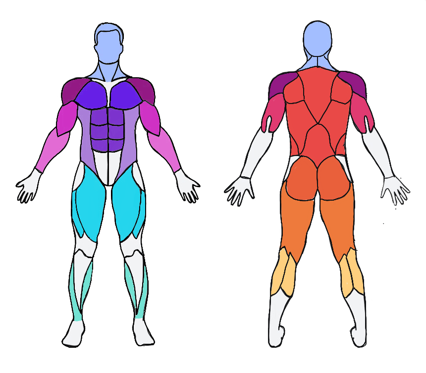

# WorkoutZen

https://replit.com/@jessicaaap/WorkoutZen?v=1

WorkoutZen is an interactive and responsive web application deployed on Replit designed to help users efficiently search for workout and exercise routines that target specific muscles, all in one convenient place. Beyond physical workouts, WorkoutZen also emphasizes the importance of brain exercises to maintain overall body health and fitness.

## Features

- **Interactive and Responsive Design:** Developed from scratch using HTML, CSS, and JavaScript with Flexbox styling to ensure a seamless and engaging user experience across all devices.
- **Locally Stored Data:** All user data is stored locally, providing quick access and ensuring privacy.
- **Comprehensive Exercise Database:** A wide variety of workout routines targeting specific muscles are available for users to search and utilize.
- **Brain Exercises:** In addition to physical exercises, WorkoutZen includes exercises aimed at keeping the brain fit and healthy.
- **Award-Winning:** Selected as a June winner for Replit’s Creator Fund Award for being innovative, well-documented, and effectively utilizing Replit-specific features such as hosting, replit db, and kaboom.js.

## Usage

1. **Search for Workouts:** Use the search feature to find workouts targeting specific muscles.
2. **Follow Routines:** Follow the detailed workout routines to achieve your fitness goals.
3. **Brain Exercises:** Participate in brain exercises to keep your mind sharp and healthy.

## Acknowledgements

- Replit for providing an excellent platform and tools!!
- Flexbox for making CSS styling efficient and responsive!!
- JavaScript for enabling interactive functionalities!!

---

Thank you for checking out WorkoutZen! Stay fit and keep your mind sharp!
